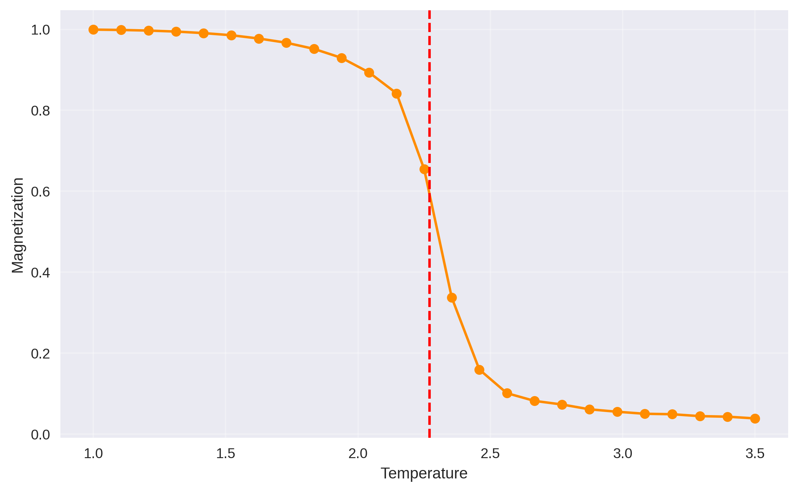
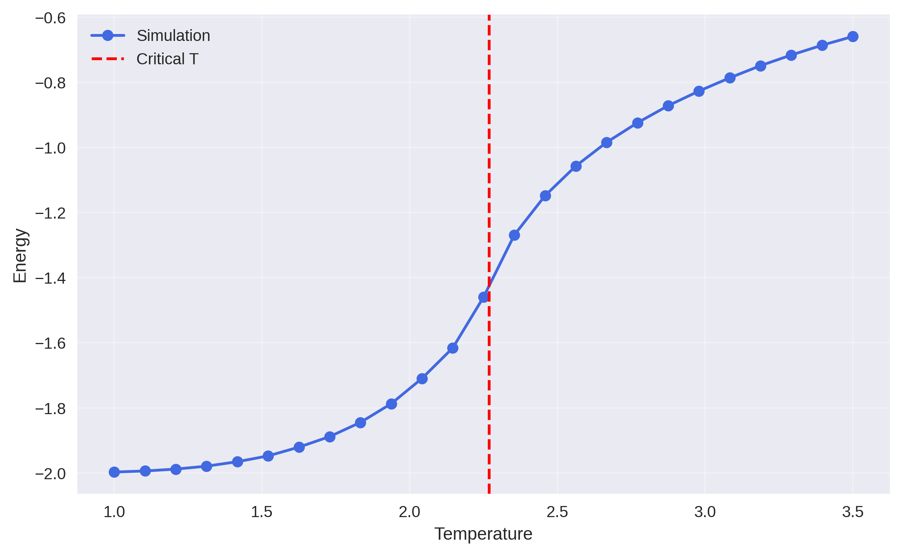
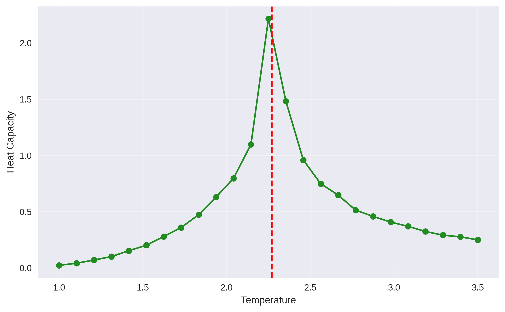
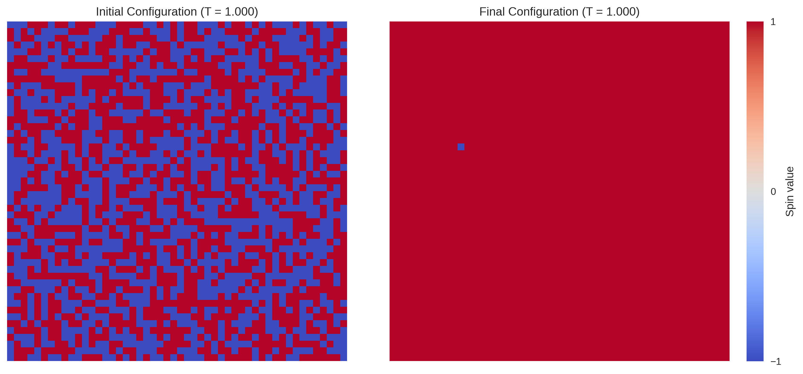
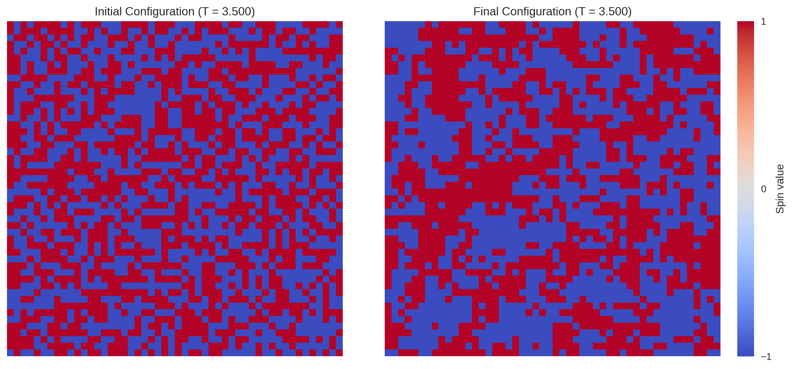

# 2D Ising Model - Python implementation

This project simulates the 2D-Ising Model to study phase transitions in a ferromagnetic system using the Monte Carlo method and Metropolis algorithm. By analyzing spin configurations on a 50×50 lattice with periodic boundary conditions (modeled as a toroid), the system’s macroscopic evolution is investigated near the critical temperature $T_c\approx2.269\frac{J}{k_B}$. Thermodynamic quantities such as average magnetization, energy expectation value, and heat capacity, are computed to characterize the abrupt transition from an ordered phase to a disordered phase at $T_c$.

## Getting Started

With these steps you'll be able to set up the project on your local machine for development and testing purposes.

### How to install
You should clone the repository into your local machine. Just copy this command:
```bash
git clone https://github.com/Reegh/2D_Ising_Model.git
```
I used python3 for this project, you can check your version with the following command:
```bash
python3 --version
```
in case it doesn´t work, you can check with
```bash
python --version
```
if none of those work, you should install python.

### Running the project
You must have the apt that allows the creation of virtual environments, if you don't have it installed, run in your terminal:
```bash
apt install python3.10-venv
```
The first time you run the code type the following in the terminal:
```bash
make build
```
this way you'll set up the virtual environment with the necessary requirementes to run the simulation.

From now on use
```bash
make run
```
to initialize the simulation.

## Project structure
2D_Ising_Model/
- [Functions/](Functions)
    - [Graphics.py](Functions/Graphics.py)
    - [Ising_Model.py](Functions/Ising_Model.py)
    - [Simulation.py](Functions/Simulation.py)
- [Results/](Results)
    - [ising_energy.png](Results/ising_energy.png)
    - [ising_heat_capacity.png](Results/ising_heat_capacity.png)
    - [ising_magnetization.png](Results/ising_magnetization.png)
    - [spin_animation_T_1.000.mp4](Results/spin_animation_T_1.000.mp4)
    - [spin_animation_T_3.500.mp4](Results/spin_animation_T_3.500.mp4)
    - [spin_configs_T_1.000.png](Results/spin_configs_T_1.000.png)
    - [spin_configs_T_3.500.png](Results/spin_configs_T_3.500.png)
- [Makefile](Makefile)
- [main.py](main.py)
- [requirements.txt](requirements.txt)
- [README.md](README.md)

## Simulation parameters
| Parameter | Default Value    | Description |
|-----------|------------------|-------------|
| `L`       | 50               | Size of the square matrix (L×L) |
| `J`       | 1.0              | Coupling constant |
| `h`       | 0.0              | External magnetic field |
| `n_steps` | 10000            | Total Monte Carlo steps |
| `eq_steps`| 2000             | Balancing steps |
| `n_T`     | 20               | Number of temperature points |
| `T_min/max`| 1.0 - 3.5       | Temperatures range |

## Results obtained
### Average magnetization

The magnetization curve exhibits textbook ferromagnetic-paramagnetic transition. Almost perfect alignment ($\approx 1$) at $T<1.5$, sharp drop at $T\approx 2.3$, and zero magnetization above $T\approx 2.8$.

### Expected value of the energy

Values near $-2.0$ at low $T$, ordered phase. There's a smooth transition around $T\approx 2.3$. It is approaching zero at high $T$, paramagnetic phase. The steep slope between $1.5<T<2.5$ reflects energy costs to disrupt magnetic order.

### Heat capacity

The pronounced peak at $T\approx 2.3$ signals the phase transition. The asymmetric shape (sharper rise than fall) and maximum value $\approx 1.75$ are characteristic for $L=50$ systems. This reflects the logarithmic divergence expected in thermodynamic limits.

### Spin configuration

At $T=1.0$: Large magnetic domains with few anti-aligned regions, typical of ordered phases.

At $T=3.5$: Completely disordered spins (paramagnetic phase), with random distribution averaging to zero magnetization.